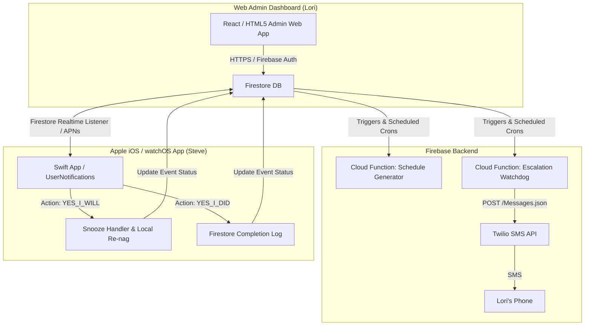

# Technical Design Specification: MediNag MVP (`MVP_DESIGN.md`)

This document outlines the system architecture, data models, mobile client design, backend services, and web dashboard for the **MediNag** Minimum Viable Product (MVP).

---

## 1. System Architecture



---

## 2. Data Models & Schemas (Firebase Firestore)

### Collection: `config` (Document ID: `settings`)
Stores global system configuration managed exclusively by Lori via the Web Admin Interface.

```json
{
  "adminPhone": "+12267475188",
  "adminName": "Lori",
  "subjectName": "Steve",
  "snoozeIntervalMinutes": 10,
  "escalationDeadlineMinutes": 30,
  "maxSnoozeCount": 3,
  "timeZone": "America/Toronto",
  "updatedAt": "2026-07-22T20:00:00Z"
}
```

### Collection: `schedules`
Defines recurring medication times set by Lori.

```json
{
  "id": "sched_morning_01",
  "medicationName": "Morning Prescription Doses",
  "scheduledTime": "08:00",
  "active": true,
  "daysOfWeek": [1, 2, 3, 4, 5, 6, 7],
  "createdAt": "2026-07-22T20:00:00Z"
}
```

### Collection: `medication_events`
Stores individual daily dose instances generated automatically by the backend.

```json
{
  "id": "evt_20260723_0800",
  "scheduleId": "sched_morning_01",
  "medicationName": "Morning Prescription Doses",
  "scheduledTime": "2026-07-23T08:00:00Z",
  "status": "pending", 
  "snoozeCount": 0,
  "lastSnoozedAt": null,
  "completedAt": null,
  "escalatedAt": null,
  "history": [
    { "timestamp": "2026-07-23T08:00:00Z", "action": "created" }
  ]
}
```

---

## 3. iOS & watchOS Client Design (Swift / SwiftUI)

### 3.1 Core Principles
- **Execution-Only UI**: The app launches into a simple, high-visibility status screen showing the next scheduled dose and today's compliance history. No settings or schedule editing controls exist in the mobile app.
- **Unified Codebase**: Shared SwiftUI and UserNotifications logic compiled for iOS and watchOS.

### 3.2 Interactive Notification Categories & Actions
Using `UNUserNotificationCenter`, the app registers custom notification categories and action buttons:

- **Category**: `MEDINAG_NAG_CATEGORY`
- **Action 1 (`ACTION_YES_I_WILL`)**:
  - **Button Title**: `"Yes, I will"`
  - **Behavior**: Acts as the Snooze button.
  - **Handler Logic**:
    1. Updates local `UNNotificationRequest` to trigger again in `snoozeIntervalMinutes`.
    2. Updates Firestore event status: `status = "snoozed"`, `snoozeCount += 1`, `lastSnoozedAt = Now()`.
    3. Plays a confirmation haptic feedback on Apple Watch / iPhone.

- **Action 2 (`ACTION_YES_I_DID`)**:
  - **Button Title**: `"Yes, I did"`
  - **Behavior**: Confirms dose completion.
  - **Handler Logic**:
    1. Cancels all pending local notifications and nag loops for this dose.
    2. Updates Firestore event status: `status = "completed"`, `completedAt = Now()`.
    3. Plays a distinct success sound & haptic.

### 3.3 Persistent Nagging Strategy
To ensure Steve cannot ignore the notification:
1. **Critical Alerts / Sound Loops**: High-volume, distinct alert sound.
2. **Local Fallback Scheduler**: If the device loses internet connection, local `UNCalendarNotificationTrigger` handles the scheduled time and subsequent snoozes autonomously.
3. **watchOS Haptics**: Uses `.heavy` or `.failure` haptic pattern loops on Apple Watch until Steve selects an option.

---

## 4. Backend Services (Firebase Cloud Functions)

### 4.1 Daily Schedule Generator (`generateDailyEvents`)
- **Trigger**: Cloud Scheduler (Runs daily at 00:01 AM).
- **Function**: Queries active records in `schedules` and creates corresponding `medication_events` documents for the current day with `status = "pending"`.

### 4.2 Escalation Watchdog (`checkUnconfirmedEvents`)
- **Trigger**: Cloud Scheduler (Runs every 5 minutes).
- **Function**:
  1. Fetches `medication_events` where `status` is `pending` or `snoozed`.
  2. Checks if `Now > scheduledTime + escalationDeadlineMinutes`.
  3. For any matching overdue event where `escalatedAt` is `null`:
     - Calls Twilio REST API to send SMS to Lori (`config.adminPhone`):
       > `"ALERT: Steve has not confirmed taking 'Morning Prescription Doses' scheduled for 8:00 AM. Please check on him immediately!"`
     - Updates event record: `escalatedAt = Now()`.

---

## 5. Web Admin Dashboard (Lori's Interface)

### 5.1 Features
1. **Schedule Management**:
   - Add, edit, or disable recurring medication times.
   - Edit medication labels (e.g., "Morning Meds - 2 Pills").
2. **Nag & Escalation Rules**:
   - Configure Snooze Duration (minutes).
   - Configure Escalation Deadline (minutes after scheduled time before SMS).
   - Update Lori's SMS phone number.
3. **Live Status & Compliance Audit Log**:
   - Real-time view of today's doses (`Pending`, `Snoozed (x2)`, `Completed at 8:12 AM`, `Escalated to SMS`).
   - Historical compliance log with export capabilities.

---

## 6. Security & Privacy

- **Firebase Authentication**: Lori authenticates via email/password or Google Sign-In on the Web Admin Dashboard.
- **Firestore Security Rules**:
  - `config` and `schedules`: Read/Write allowed only for authenticated Lori (`auth.uid != null`). Read-only for Steve's device.
  - `medication_events`: Write allowed for Steve's device (`YES_I_WILL`, `YES_I_DID` status updates) and backend Cloud Functions.
- **Twilio API Credentials**: Stored securely in Firebase Functions environment config (`defineSecret`), never exposed to client applications.
