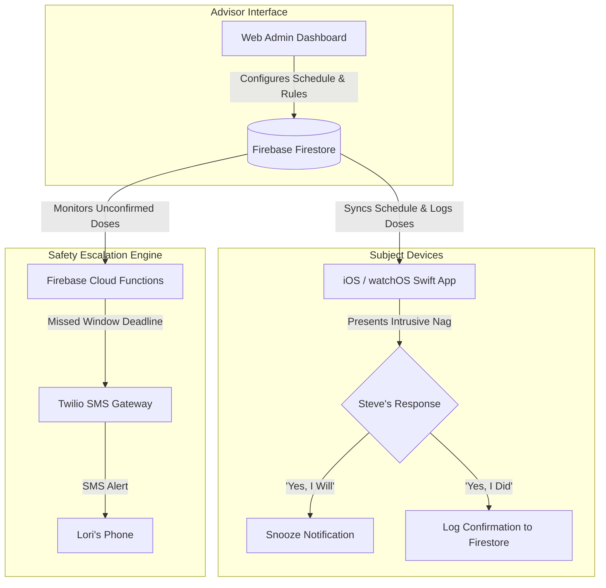

# MediNag (`medinag`)

> **An intrusive, high-assurance medication nagging and escalation system for iOS, watchOS, and the Web.**

`medinag` is designed to ensure strict medication compliance for **Steve** (the subject) while providing a centralized management dashboard and automated SMS escalation safety net for **Lori** (the advisor).

---

## 📖 Documentation

Detailed project documentation is available in the repository:

- 🎯 **[VISION.md](file:///home/svorkoetter/medinag/VISION.md)**: Product vision, user personas, core philosophy, and future roadmap.
- 📐 **[MVP_DESIGN.md](file:///home/svorkoetter/medinag/MVP_DESIGN.md)**: Technical architecture, data schemas, Swift iOS/watchOS client design, Firebase Cloud Functions escalation engine, and Web Admin dashboard specs.
- 🧪 **[E2E_GUIDE.md](E2E_GUIDE.md)**: Cross-platform user-story walkthrough, screenshot, and synchronization requirements.

---

## 🏗 System Overview



---

## 🛠 Tech Stack

- **Mobile Client**: Swift / SwiftUI for iOS and watchOS (User Notifications Framework, WatchKit / WatchConnectivity).
- **Backend & Database**: Firebase Firestore (Realtime DB/Firestore) + Firebase Cloud Functions (Node.js/TypeScript).
- **Escalation Gateway**: Twilio REST API (SMS notifications to Lori).
- **Web Admin Dashboard**: Lightweight Web Interface (HTML5 / Vanilla JS or Vite React) for schedule and policy management.

---

## 🚀 Repository Layout

```text
~/medinag/
├── README.md           # Project overview & quick reference
├── VISION.md           # Product philosophy & roadmap
├── MVP_DESIGN.md       # Full technical architecture & specifications
├── apps/ios/           # SwiftUI iOS MVP, deterministic core, and native tests
├── backend/            # (Future) Firebase Cloud Functions & Firestore security rules
├── tests/e2e/          # Playwright stories, walkthroughs, and screenshots
└── web/                # Web Admin Dashboard for Lori
```

## Run the Web Dashboard

```bash
npm install
npm run dev
```

Open `http://127.0.0.1:5174`. Use `npm run check`, `npm run build`, and
`npm run test:e2e` to run the same validations used by CI.

## Run the iOS MVP

The iOS project, its pinned toolchain, Firebase configuration boundary, and
native testing instructions are documented in
[apps/ios/README.md](apps/ios/README.md). The portable core checks run without
Xcode:

```bash
npm run ios:core:check
npm run ios:generate
```

### Firebase Development

Firebase CLI `15.24.0` and the Firebase Web SDK are pinned in `package.json`.
The repository is connected to the production Firebase project `medinag`.
Firestore rules and indexes, anonymous preview authentication, and the local
Auth and Firestore emulators are managed as code:

```bash
npm run firebase:emulators
npm run firebase:validate
npm run firebase:deploy
```

The emulator requires Java 21, which is included in the Nix development shell.
Copy `.env.example` to `.env.local` and provide the Firebase web-app
configuration to exercise the production backend locally. Without configuration,
the dashboard deliberately uses browser-local preview data so deterministic E2E
tests never mutate production.

GitHub Pages builds receive every Firebase web-app configuration field through
Actions secrets named `VITE_FIREBASE_API_KEY`, `VITE_FIREBASE_AUTH_DOMAIN`,
`VITE_FIREBASE_PROJECT_ID`, `VITE_FIREBASE_STORAGE_BUCKET`,
`VITE_FIREBASE_MESSAGING_SENDER_ID`, `VITE_FIREBASE_APP_ID`,
`VITE_FIREBASE_PROJECT_NUMBER`, and `VITE_FIREBASE_CONFIG_VERSION`. The dashboard
signs each preview browser into Firebase anonymously and stores schedules beneath
that account's UID. Firestore rules prevent one preview session from reading or
changing another session's schedules.

### Linking Lori's Google Account

An anonymous dashboard shows a **Continue with Google** action above Lori's
schedules. Firebase links the Google credential to the current anonymous user,
which normally preserves the UID, then migrates schedules from
`admins/{uid}/schedules` to `households/{uid}/schedules`. If the Gmail credential
already belongs to another Firebase user, the dashboard signs into that account
and copies the schedules captured before sign-in. Existing legacy documents are
left intact as rollback evidence; all subsequent reads and writes use the
household path.

Household membership records assign `advisor` or `subject` roles. Advisors can
manage schedules, subjects have read-only schedule access, and subject writes to
medication events are restricted to valid snooze and completion transitions.
Run the complete Auth/Firestore rules suite with:

```bash
nix develop -c npm run firebase:validate
```
