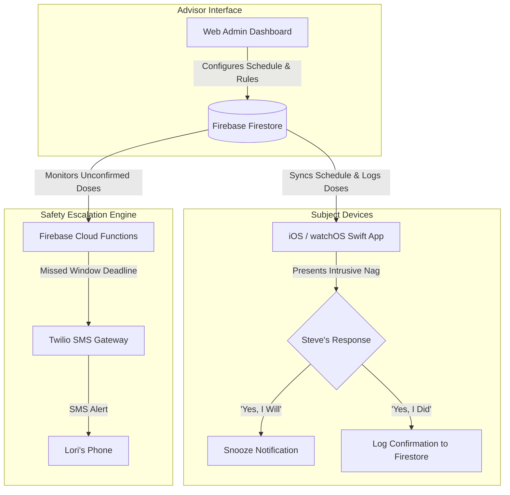

# MediNag (`medinag`)

> **An intrusive, high-assurance medication nagging and escalation system for iOS, watchOS, and the Web.**

`medinag` is designed to ensure strict medication compliance for **Steve** (the subject) while providing a centralized management dashboard and automated SMS escalation safety net for **Lori** (the advisor).

---

## 📖 Documentation

Detailed project documentation is available in the repository:

- 🎯 **[VISION.md](file:///home/svorkoetter/medinag/VISION.md)**: Product vision, user personas, core philosophy, and future roadmap.
- 📐 **[MVP_DESIGN.md](file:///home/svorkoetter/medinag/MVP_DESIGN.md)**: Technical architecture, data schemas, Swift iOS/watchOS client design, Firebase Cloud Functions escalation engine, and Web Admin dashboard specs.

---

## 🏗 System Overview



---

## 🛠 Tech Stack

- **Mobile Client**: Swift / SwiftUI for iOS and watchOS (User Notifications Framework, WatchKit / WatchConnectivity).
- **Backend & Database**: Firebase Firestore (Realtime DB/Firestore) + Firebase Cloud Functions (Node.js/TypeScript).
- **Escalation Gateway**: Twilio REST API (SMS notifications to Lori).
- **Web Admin Dashboard**: Lightweight Web Interface (HTML5 / Vanilla JS or Vite React) for schedule and policy management.

---

## 🚀 Repository Layout

```text
~/medinag/
├── README.md           # Project overview & quick reference
├── VISION.md           # Product philosophy & roadmap
├── MVP_DESIGN.md       # Full technical architecture & specifications
├── apps/               # (Future) Swift iOS & watchOS codebase
├── backend/            # (Future) Firebase Cloud Functions & Firestore security rules
└── web/                # (Future) Web Admin Dashboard for Lori
```
