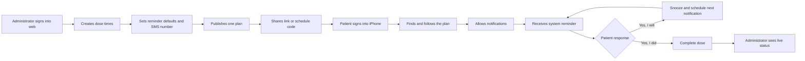
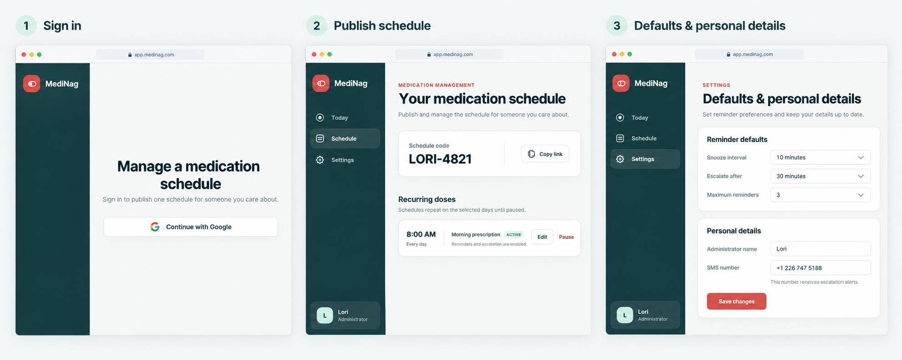
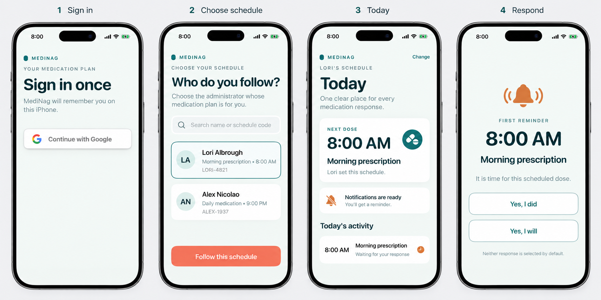

# MediNag UX Design: One Administrator, One Patient, One Plan

Status: proposed for product review. This document defines the intended user
experience; it does not authorize implementation yet.

## Outcome

MediNag should use a public schedule-following model instead of households,
invitations, or administrator-created patient accounts:

1. Any person can sign into the web app with Google and become an administrator.
2. An administrator creates and publishes one medication plan.
3. Any person can sign into the iPhone app with Google and find a published plan.
4. The patient chooses one plan to follow.
5. The iPhone remembers the patient and chosen plan on future launches.
6. Reminders and responses continue to use the real published plan and shared
   event data.

The relationship is deliberately one-to-one for this version:

- one administrator owns one published plan;
- one plan has one patient follower;
- one patient follows one plan.

Discovery is public, but following a plan claims its available patient slot. An
administrator can disconnect the current patient, and a patient can leave a plan,
so mistakes are recoverable without support or data migration.

## Product principles

### Authentication identifies people; it does not establish the relationship

Google Sign-In is the only sign-in method on the web and iPhone. The same Google
identity can use either surface. Opening the web app creates an administrator
profile when needed; opening the iPhone app creates a patient profile when needed.

There are no passwords managed by MediNag, household IDs, pre-provisioned patient
accounts, or membership documents that the administrator must create first.

### Following should feel like choosing, not configuring

The patient sees human-readable administrator names and schedule summaries. A
short schedule code and share link make an exact plan easy to find when names are
ambiguous. The patient never edits medication times or reminder policy.

### Publishing should be deliberate

An administrator can prepare an incomplete draft without making it discoverable.
The first **Publish schedule** action requires at least one active dose, an
administrator display name, a valid time zone, and valid reminder defaults. Later
edits use **Save & publish** and become available to the linked iPhone immediately.

### Reminder choices remain neutral

On a reminder response screen, **Yes, I did** and **Yes, I will** have identical
visual weight and neither is selected by default. **Yes, I will** snoozes the event,
dismisses the response UI, and relies on a later system notification to bring the
patient back. **Yes, I did** completes the event and cancels later reminders.

## End-to-end journey



No step requires the administrator and patient to be signed in at the same time.

## Visual direction

The mockups intentionally retain the existing MediNag visual language:

- deep-teal navigation and primary text;
- pale mint or warm off-white page backgrounds;
- white cards with generous radius and whitespace;
- coral primary web actions;
- teal native iPhone actions;
- amber for attention and green for completed/ready states;
- large, direct headings and calm supporting copy.

The generated boards are directional high-fidelity mockups. The written copy and
behavior in this document are authoritative where a rendered image is ambiguous.

### Administrator web journey



### Patient iPhone journey



The boards were generated from these existing visual references:

- `tests/e2e/002-manage-schedules/screenshots/002-schedule-created.png`
- `tests/e2e/004-ios-respond-to-dose/screenshots/web/002-event-observed-on-dashboard.png`
- `tests/e2e/004-ios-respond-to-dose/screenshots/ios/000-subject-sign-in.png`
- `tests/e2e/004-ios-respond-to-dose/screenshots/ios/001-firestore-event-received.png`
- `tests/e2e/004-ios-respond-to-dose/screenshots/ios/005-first-reminder-response.png`

## Administrator web experience

The signed-out web app has one purpose: explain that this is where someone
publishes and manages a medication plan, then offer **Continue with Google**.
There is no anonymous preview workspace and no later account-linking banner.

### Web information architecture

```text
MediNag
├── Today
│   ├── linked-patient status
│   └── today's medication events
├── Schedule
│   ├── publication and sharing
│   └── recurring dose times
└── Settings
    ├── reminder defaults
    └── personal details and escalation SMS
```

### W1 — Sign in

- Heading: **Manage a medication schedule**
- Supporting copy: **Sign in to publish one schedule for someone you care about.**
- Primary action: **Continue with Google**
- A cancelled or failed Google flow returns here with a concise inline error.

### W2 — First-run setup

After first sign-in, the administrator sees a checklist-style empty state:

1. Confirm administrator display name and time zone.
2. Add at least one recurring dose.
3. Review reminder defaults and escalation SMS number.
4. Publish the plan.

The plan name defaults to **[Administrator name]'s medication schedule** and can
be edited. The setup may span the Schedule and Settings routes, but persistent
progress makes the next required step obvious.

### W3 — Schedule editor

The administrator's one plan can contain multiple dose definitions. Each dose has:

- medication label;
- local time;
- days of the week;
- active or paused state.

The page provides **Add dose**, **Edit**, **Pause**, and **Resume** actions. It does
not offer a second plan. Empty drafts are valid; empty plans cannot be published.

Before first publication, the page shows draft status and **Publish schedule**.
After publication, it shows **Save & publish** only when changes are pending.
Leaving with unsaved changes prompts the administrator to discard or continue
editing.

### W4 — Published plan and sharing

Publishing creates two stable discovery handles:

- a short, case-insensitive schedule code such as `LORI-4821`;
- a share link that opens the matching iPhone selection screen.

The Schedule page shows publication status, last-published time, schedule code,
**Copy code**, and **Copy link**. Regenerating the code is an advanced destructive
action with confirmation; ordinary edits do not change it.

The relationship card has one of three states:

- **Waiting for a patient** — the plan remains searchable;
- **Followed by [name]** — includes the link date;
- **Patient disconnected** — the plan is available to follow again.

An administrator may use **Disconnect patient** with confirmation. This stops new
events for that patient but preserves historical dose activity.

### W5 — Reminder defaults

Defaults apply to every dose in the plan for this version:

- snooze interval, initially 10 minutes;
- escalation deadline after the scheduled time;
- maximum number of reminder notifications;
- plan time zone.

Values use constrained controls rather than free text. Helper copy explains the
effect in plain language, including an example calculated from the current value.
Per-dose overrides are out of scope.

### W6 — Personal details

The administrator can edit:

- display name shown in iPhone discovery;
- SMS number that receives escalation alerts.

The SMS number uses an international phone input, shows its normalized value, and
requires verification before escalation is considered ready. Name changes do not
break existing links or change the schedule code.

### W7 — Today

Today answers three questions without requiring the administrator to inspect the
schedule editor:

1. Is a patient linked?
2. What dose is next?
3. Which doses are pending, snoozed, completed, or escalated?

Updates arrive live. Each activity row shows scheduled time, medication label,
state, last response time, reminder count, and escalation outcome where relevant.

## Patient iPhone experience

The iPhone app has three top-level modes: signed out, signed in without a selected
plan, and following a plan. It never asks for a household ID.

### P1 — Sign in

- Eyebrow: **YOUR MEDICATION PLAN**
- Heading: **Sign in once**
- Supporting copy: **MediNag will remember you on this iPhone.**
- Primary action: **Continue with Google**

Successful authentication goes directly to plan selection if the account has no
current plan. A returning patient with a valid plan goes directly to Today.

### P2 — Choose a schedule

The selection screen answers **Who do you follow?** and offers:

- a search field for administrator name or exact schedule code;
- public, available plans matching the query;
- administrator name, plan name, next dose summary, and schedule code on each row;
- a single selected row and **Follow this schedule** confirmation action.

An inbound share link pre-fills the exact result but never follows it silently.
The patient must see the administrator and dose summary and explicitly confirm.

If a plan has already been claimed by another patient, it is not selectable and
is labeled **Already followed**. If the same patient opens it again, the action is
**Continue with this schedule**.

### P3 — Notification permission

Ask for iOS notification permission only after a plan is followed and the benefit
is concrete. The in-app card explains that reminders are required, then the native
iOS permission sheet appears after the patient taps **Allow**.

If permission is denied, Today remains usable but presents a persistent
**Notifications are off** card with **Open Settings**. The app does not repeatedly
trigger the system prompt.

### P4 — Today

Today retains the current large-type, execution-only layout:

- eyebrow identifies **[Administrator name]'s schedule**;
- the next-dose card emphasizes time and medication label;
- reminder readiness is visible but secondary;
- today's activity shows pending, snoozed, completed, and missed doses;
- **Change** is a quiet navigation action, not a primary call to action.

The patient cannot edit times, reminder defaults, administrator details, or SMS
settings.

### P5 — Change schedule

**Change** opens the selection flow with the current plan identified. Choosing a
different plan requires confirmation:

> Stop following Lori's schedule and follow Alex's schedule instead?

Confirming releases the old one-to-one link, cancels its future local
notifications, establishes the new link, and resynchronizes before reporting
success. Historical responses stay with the old plan.

### P6 — System notification and response

At the published dose time, iOS renders the system notification. Tapping that
notification cold-launches or foregrounds MediNag into the response screen. The
response UI is not available early from Today.

The response screen shows:

- reminder number;
- original scheduled time, not the current clock time;
- medication label;
- equal-weight **Yes, I did** and **Yes, I will** actions;
- explicit text that neither response is selected by default.

After **Yes, I will**, the response is recorded, the next notification is scheduled
using the administrator's snooze interval, and the response screen closes. The app
does not need to remain running. The next response screen is reachable only by
tapping the next system notification.

After **Yes, I did**, completion is recorded, remaining notifications for that dose
are cancelled, and Today shows the completion timestamp.

### P7 — Plan unavailable

If an administrator unpublishes the plan or disconnects the patient, the app
cancels future notifications and shows:

- heading: **Choose a new schedule**;
- explanation naming the unavailable plan;
- primary action: **Find a schedule**.

The account remains signed in.

## Shared loading, offline, and error behavior

- Authentication, publication, following, and response actions disable only the
  initiating control and show progress in place.
- A successful action is not reported until the backend confirms it.
- Cached schedule data remains visible offline with a compact **Offline** banner and
  last-updated time.
- A dose response made offline is labeled **Sending…** until synchronized and must
  be idempotent if retried.
- Empty search results suggest checking the code or asking the administrator to
  publish the plan; they never suggest creating a household membership.
- Destructive relationship changes always name both people and their schedule.

## Accessibility and content requirements

- Support Dynamic Type without truncating medication names or action labels.
- Maintain at least 44-by-44-point iPhone targets and equivalent accessible web
  targets.
- Do not communicate pending, snoozed, completed, or escalated state by color alone.
- Give every icon a visible label or accessibility label.
- Preserve equal visual and VoiceOver ordering for the two reminder responses.
- Announce live status changes without moving keyboard or VoiceOver focus.
- Use **administrator**, **patient**, **schedule**, **dose**, and **follow** in user
  copy. Retire **advisor**, **subject**, **household**, **pair**, and **membership**.

## Review decisions

Approval of this design also approves these product decisions:

1. Google Sign-In is the only authentication method on both surfaces.
2. A plan becomes public only after an explicit first publish.
3. One plan contains one or more recurring dose definitions.
4. Following is a patient-initiated claim; administrator pre-approval is not needed.
5. The one-to-one link is enforced and can be released by either side.
6. The administrator's SMS number receives escalation messages.
7. iPhone schedule selection uses public search, stable codes, and share links.
8. watchOS mirrors the chosen iPhone plan later; watch onboarding is out of scope for
   this design review.

## Walkthrough inventory for implementation

The eventual user-story walkthrough should capture every meaningful state:

1. administrator web sign-in;
2. empty draft and setup checklist;
3. dose editor;
4. reminder defaults and personal details;
5. published plan with code and share link;
6. patient iPhone sign-in;
7. schedule search and selection;
8. follow confirmation;
9. notification education and native permission prompt;
10. linked Today screen;
11. first system notification;
12. first response screen;
13. snoozed state on web and iPhone;
14. repeat system notification with the app terminated;
15. completion on iPhone and live completion on web;
16. change-schedule confirmation;
17. disconnected-plan recovery.
