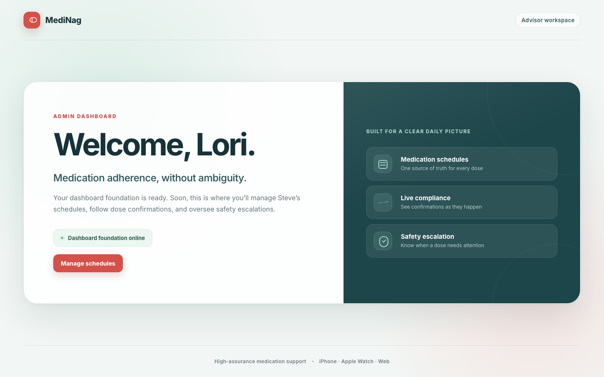

# Test: US-001: Lori opens the admin dashboard

> As Lori, I want to open the MediNag dashboard so that I know my advisor workspace is ready.

## Surface coverage

- **Web Admin Dashboard:** covered
- **iOS:** not-applicable — This story introduces only Lori's web dashboard scaffold.
- **watchOS:** not-applicable — This story introduces only Lori's web dashboard scaffold.

## Lori sees the MediNag advisor welcome page

**Verifications:**

- [x] The dashboard signals that deterministic rendering is ready
- [x] The browser title identifies MediNag Admin
- [x] The welcome heading addresses Lori
- [x] The dashboard reports that its foundation is online
- [x] The upcoming dashboard capabilities are visible
- [x] Lori can continue to schedule management
