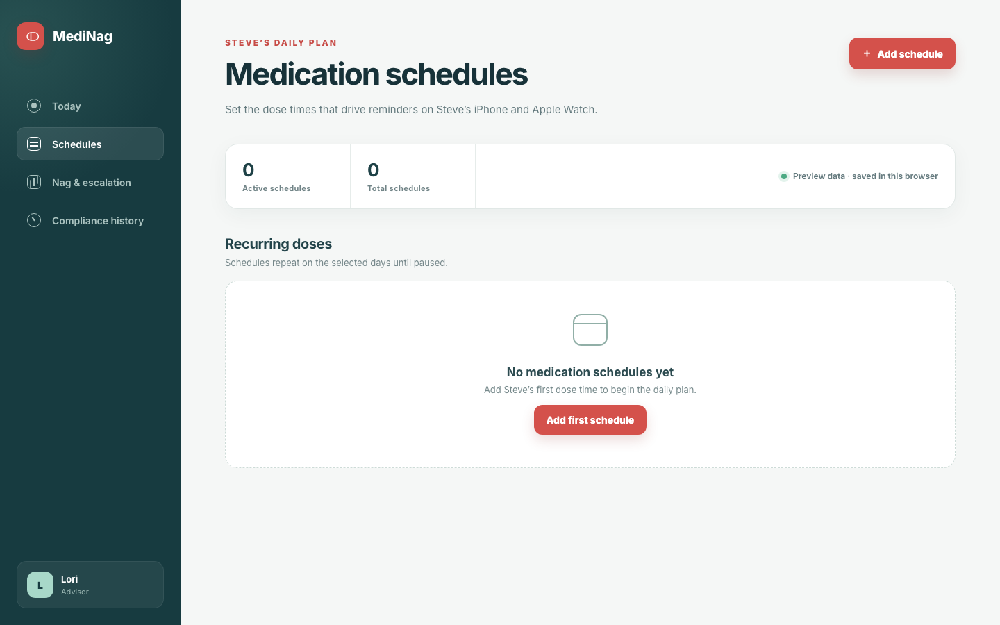
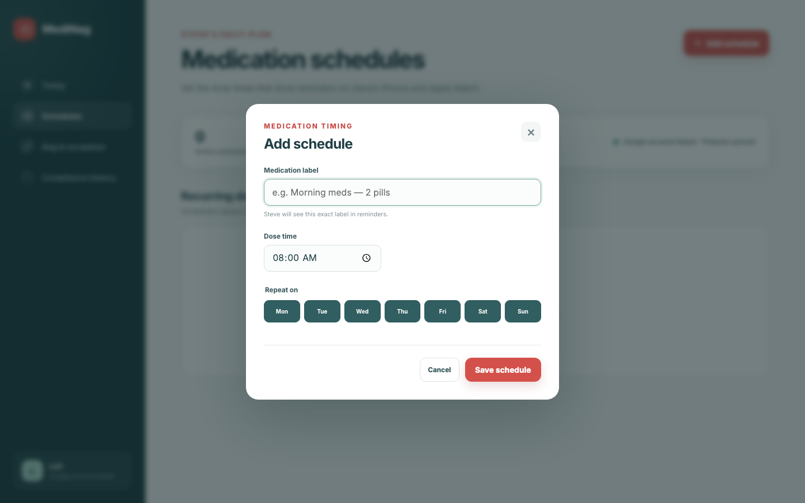
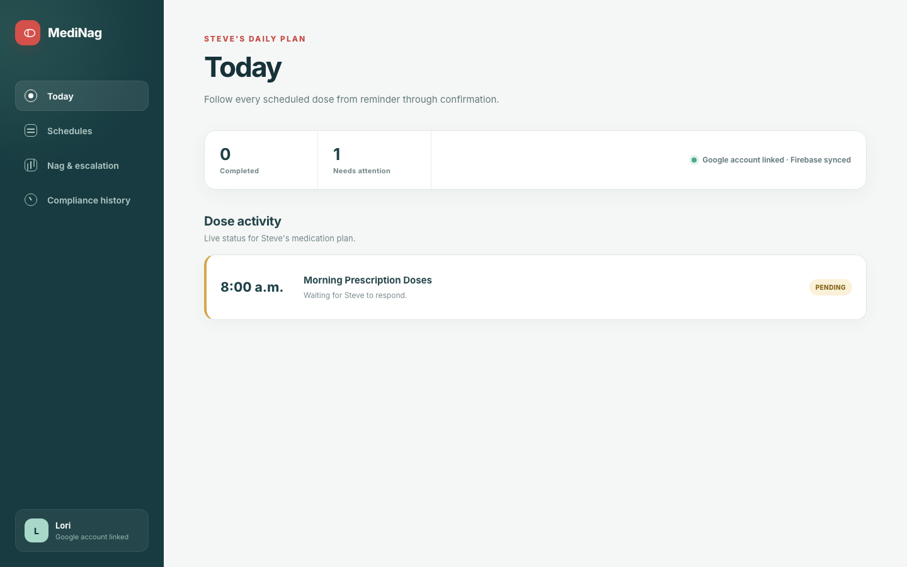
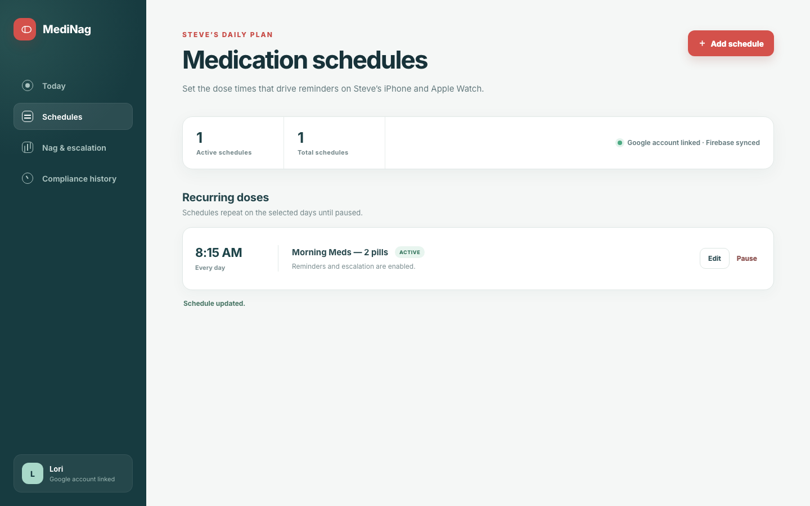
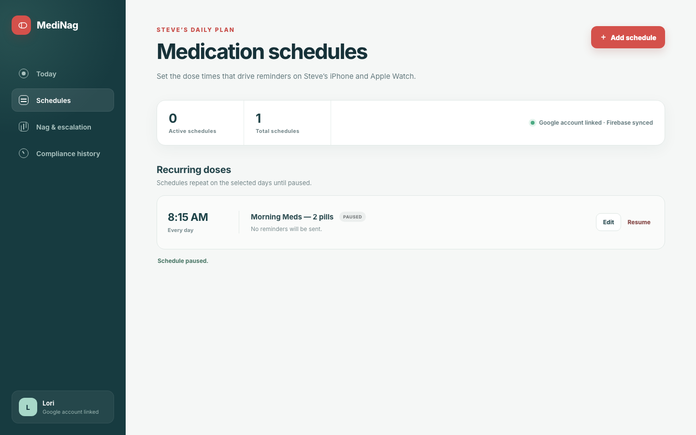

# Test: US-002: Lori manages medication schedules

> As Lori, I want to create, edit, and pause Steve's medication schedules so that his reminders match the daily plan.

## Surface coverage

- **Web Admin Dashboard:** covered
- **iOS:** not-applicable — This story configures schedules in Lori's web dashboard.
- **watchOS:** not-applicable — This story configures schedules in Lori's web dashboard.

## Lori starts with a clear medication schedule

**Verifications:**

- [x] The schedule page reports deterministic rendering is ready
- [x] The medication schedule heading is visible
- [x] No schedules are present
- [x] The dashboard is connected to the isolated Firebase environment

## Lori opens the new schedule form

**Verifications:**

- [x] The schedule dialog is visible
- [x] Every day is selected by default

## Lori adds Steve’s morning medication schedule

**Verifications:**

- [x] The morning medication label is listed
- [x] The schedule repeats every day at 8:00 AM
- [x] The schedule is active

## The schedule produces a pending medication event in Firestore

**Verifications:**

- [x] The Today route receives the medication event through a Firestore listener
- [x] The event is pending for Steve

## Lori updates the medication label and dose time

**Verifications:**

- [x] The updated medication label is listed
- [x] The updated schedule time is 8:15 AM
- [x] The dashboard confirms the update

## Lori pauses the medication schedule

**Verifications:**

- [x] The schedule is marked paused
- [x] The dashboard confirms that the schedule is paused
- [x] The schedule can be resumed
