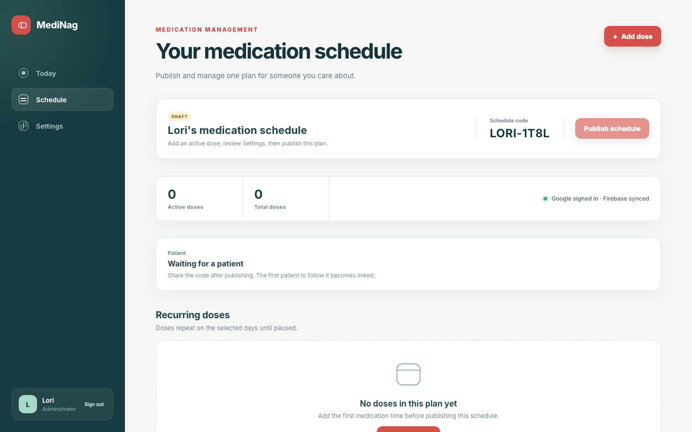
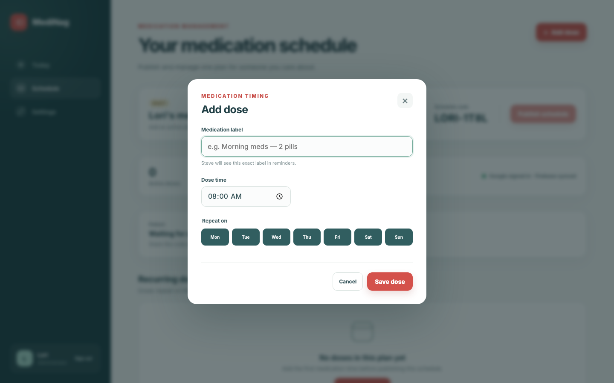
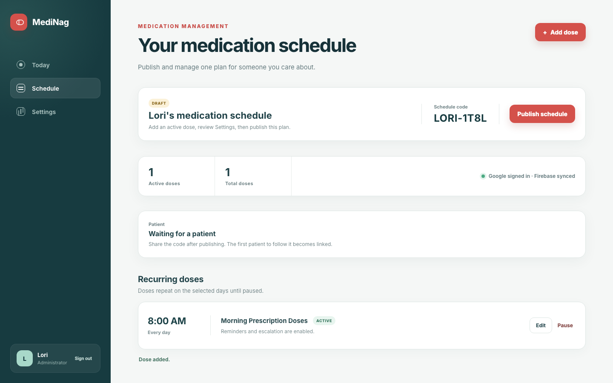
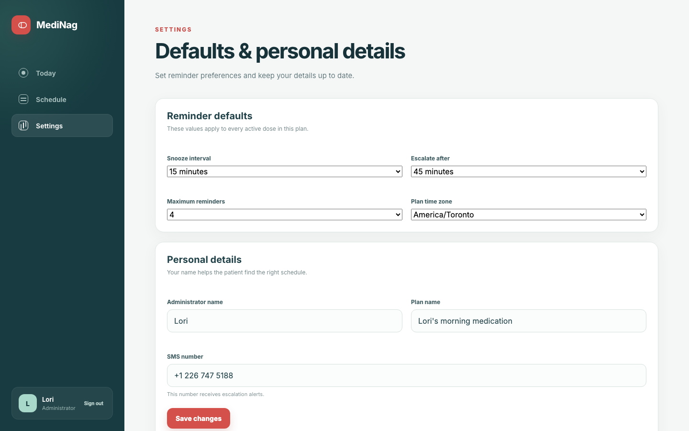
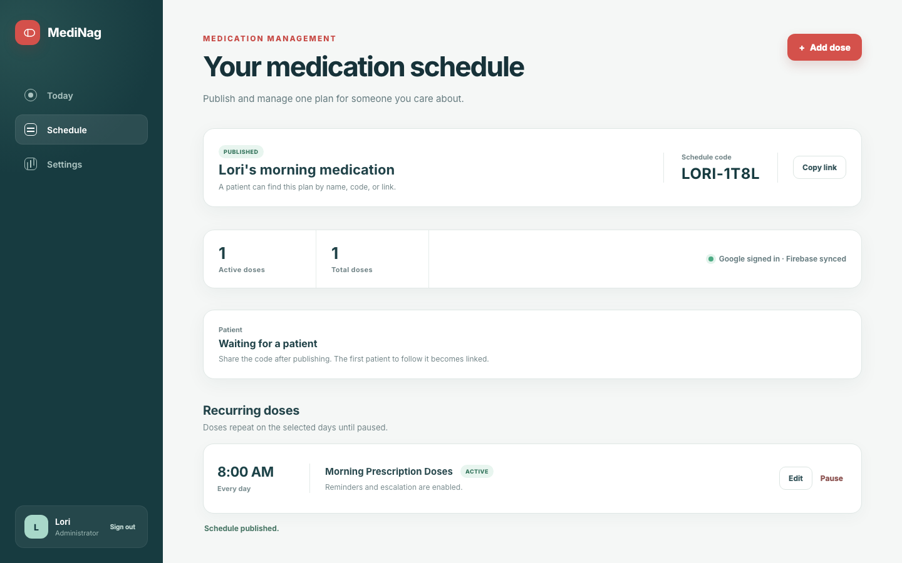
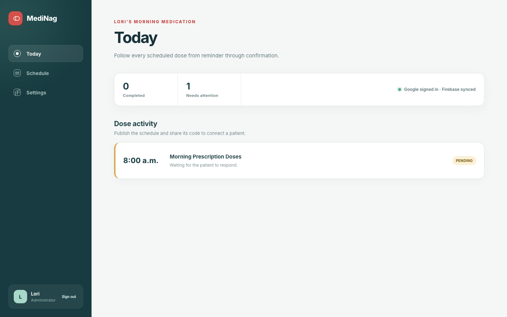

# Test: US-002: an administrator publishes one medication plan

> As an administrator, I want to publish one medication plan and its reminder defaults so that a patient can follow it.

## Surface coverage

- **Web Admin Dashboard:** covered
- **iOS:** not-applicable — This story configures the administrator's plan in the web dashboard.
- **watchOS:** not-applicable — This story configures the administrator's plan in the web dashboard.

## Lori opens her new administrator plan

**Verifications:**

- [x] The authenticated administrator dashboard is ready
- [x] The page manages one medication schedule
- [x] The unpublished plan starts empty
- [x] The dashboard uses Google and Firebase

## Lori opens the first dose form

**Verifications:**

- [x] The dose dialog is visible
- [x] Every day is selected by default

## Lori adds the recurring morning dose

**Verifications:**

- [x] The dose is rendered from Firestore
- [x] The dose repeats every day at 8:00 AM
- [x] The real write completes

## Lori sets reminder defaults and personal details

**Verifications:**

- [x] The configurable snooze interval is saved
- [x] The escalation SMS number is saved
- [x] The dashboard confirms the settings write

## Lori publishes one discoverable medication plan

**Verifications:**

- [x] The plan is published
- [x] A stable schedule code is visible
- [x] A share link can be copied

## The published dose has a live medication event

**Verifications:**

- [x] The Today route receives the Firestore event
- [x] The event is waiting for a patient response
