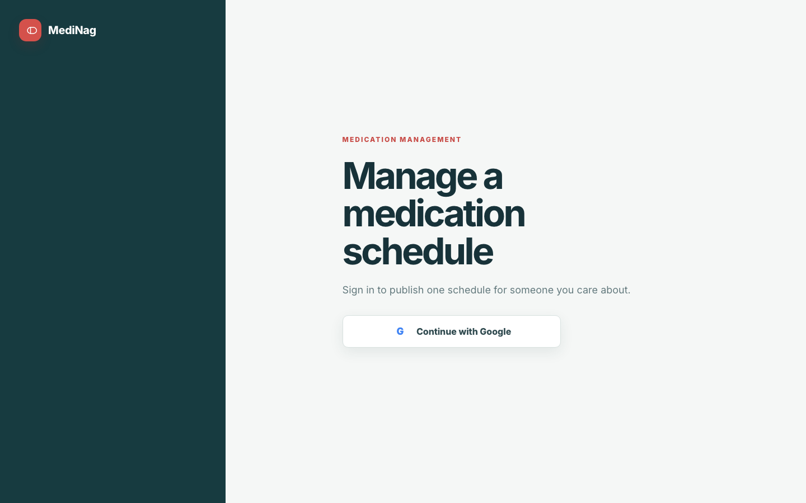
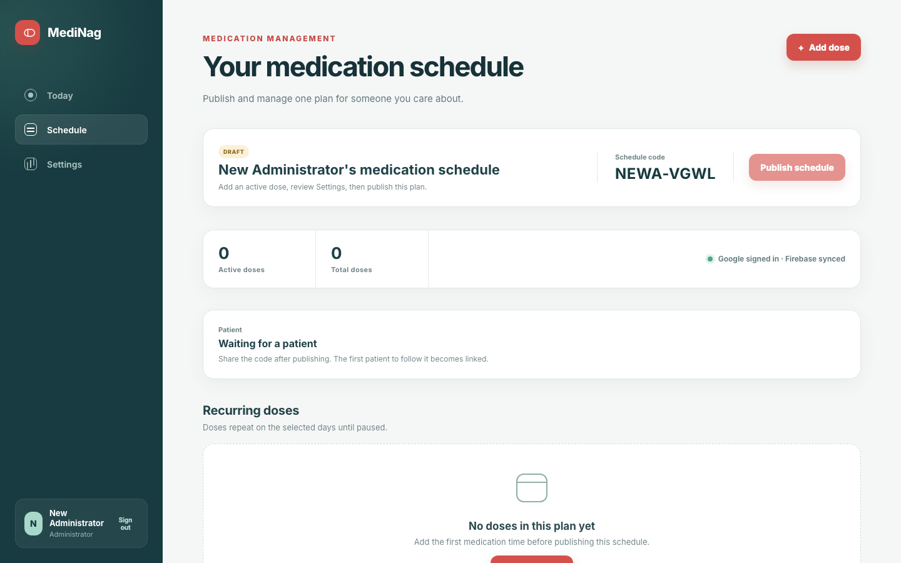

# Test: US-003: anyone can become an administrator with Google

> As a family member, I want to sign in with Google so that I can publish one medication plan.

## Surface coverage

- **Web Admin Dashboard:** covered
- **iOS:** not-applicable — This story covers administrator onboarding in the web dashboard.
- **watchOS:** not-applicable — The watchOS client is explicitly deferred until after the iOS MVP.

## A signed-out visitor sees the administrator entry point

**Verifications:**

- [x] The page explains the administrator purpose
- [x] Google is the only sign-in method
- [x] No email or password fields are present

## Google Sign-In creates a new administrator plan

**Verifications:**

- [x] The authenticated dashboard finishes rendering
- [x] The visitor is identified as an administrator
- [x] A single unpublished plan is ready for its first dose
- [x] No household linking step appears
