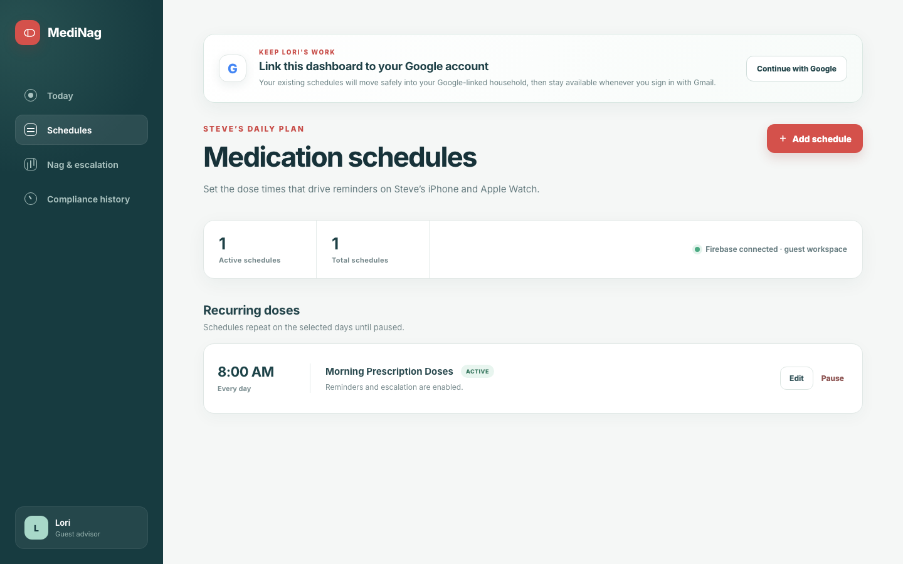
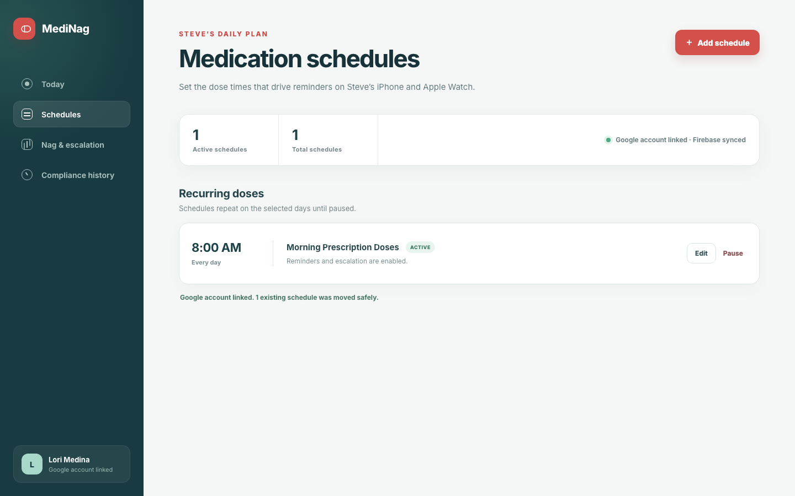
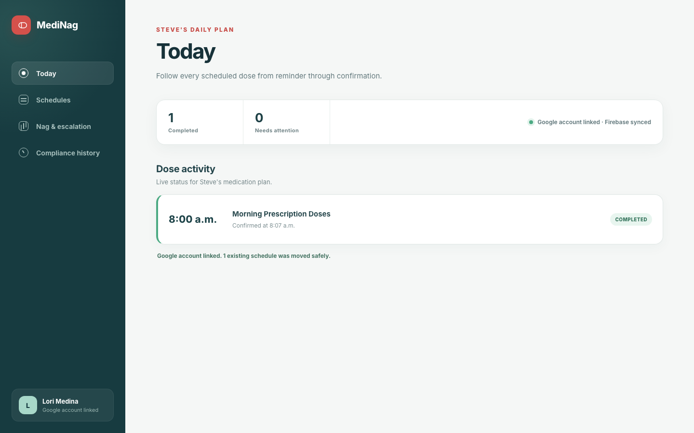

# Test: US-003: Lori links her existing schedules to Google

> As Lori, I want to link my existing schedules to my Google account so that my work is preserved and ready to sync with Steve's devices.

## Surface coverage

- **Web Admin Dashboard:** covered
- **iOS:** not-applicable — Phase 1 establishes the shared Firebase contract before the iOS client is implemented.
- **watchOS:** not-applicable — The watchOS client is explicitly deferred until after the iOS MVP.

## Lori sees that her guest schedules can move with her

**Verifications:**

- [x] The dashboard is deterministically ready
- [x] The Google linking explanation is visible
- [x] Lori can see her existing medication schedule before linking

## Lori links Gmail without losing the schedule she already entered

**Verifications:**

- [x] The linked dashboard finishes rendering
- [x] The dashboard confirms that Google and Firebase are connected
- [x] The migration confirmation reports one preserved schedule
- [x] The existing schedule remains available after linking

## Lori sees Steve's latest dose status in the shared household

**Verifications:**

- [x] The Today route finishes rendering
- [x] The completed morning dose is visible
- [x] The dose status is completed
- [x] The confirmation time is shown in Toronto time
