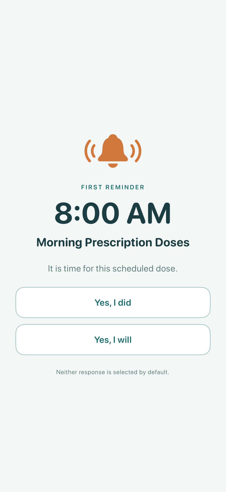
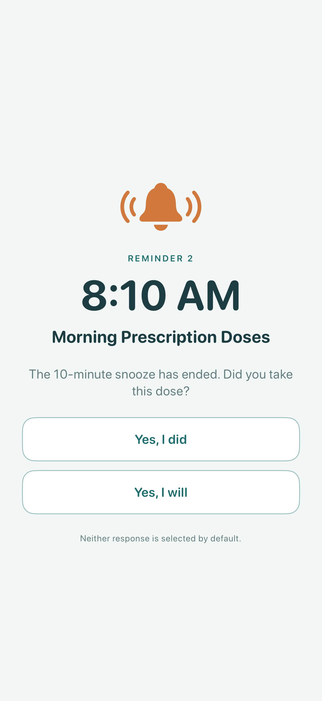
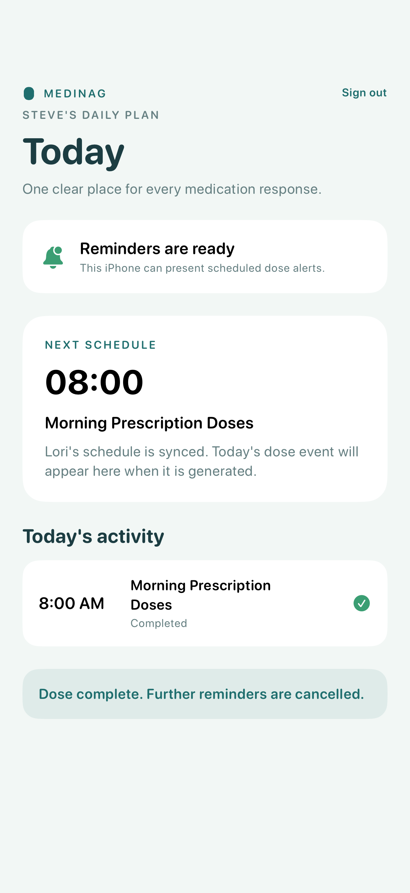

# Test: Steve responds to a scheduled dose

> As Steve, I want to snooze and then complete a medication reminder so Lori can see an accurate response.

## Surface coverage

- **Web Admin Dashboard:** not-applicable — This story exercises Steve's local iOS response loop.
- **iOS:** covered
- **watchOS:** not-applicable — watchOS is deferred until after the iOS MVP.

## Deterministic preconditions

- Fixtures: `scheduled-dose-first-reminder` and `scheduled-dose-repeat-due`
- Clock: 2026-08-03 08:00 America/Toronto, advanced directly to 08:10 for the repeat
- Device: iPhone 17 on iOS 26.2, portrait, light appearance, standard Dynamic Type
- Status bar: hidden in E2E so the runner's real wall clock cannot contradict the fixture
- Snooze interval: 10 minutes from `DoseCoordinator.defaultSnoozeInterval`

## The first medication reminder arrives exactly at 8:00 AM

**Verifications:**

- [x] The first alert is visible
- [x] This is the first reminder
- [x] The first reminder arrives at 8:00 AM
- [x] The snooze response is available
- [x] The completion response is available
- [x] Neither response has greater visual weight

## Steve chooses Yes, I will and the dose is snoozed for 10 minutes

**Verifications:**

- [x] The snooze count increments
- [x] The configured repeat interval is confirmed
- [x] The dose remains unfinished

## At 8:10 AM the expired snooze presents the next reminder

**Verifications:**

- [x] The repeat alert is visible
- [x] This is reminder 2
- [x] The repeat arrives at 8:10 AM
- [x] Yes, I will is offered after the repeat
- [x] Yes, I did is offered after the repeat
- [x] Neither response has greater visual weight

## Steve chooses Yes, I did and further nags are cancelled

**Verifications:**

- [x] The dose is completed
- [x] The app confirms cancellation
