# Test: Lori schedules and Steve responds to a dose

> As Lori and Steve, we want a dashboard schedule to become an iOS notification and Steve’s response to return to the dashboard.

## Surface coverage

- **Web Admin Dashboard:** covered
- **iOS:** covered
- **watchOS:** not-applicable — watchOS is deferred until after the iOS MVP.

## Deterministic preconditions

- Backend: a fresh Firebase Authentication and Firestore emulator suite with security rules enabled
- Data: Lori creates the schedule through the dashboard; no schedule or medication event is preloaded or encoded in the native test
- Identity: advisor and subject credentials are generated for the run through Firebase Auth
- Clock: notification delivery is advanced on the app-background event; logical reminder times remain derived from the Firestore event
- Device: iPhone 17 on iOS 26.5, portrait, light appearance, increased contrast, medium Dynamic Type
- Status bar: fixed at 8:00 AM with a Simulator override
- System UI: notification permission and both reminders are rendered by iOS SpringBoard
- Lifecycle: the UI test terminates MediNag before it captures or taps either notification
- Snooze interval: 10 minutes from `DoseCoordinator.defaultSnoozeInterval`

## Lori opens a fresh dashboard connected to Firebase

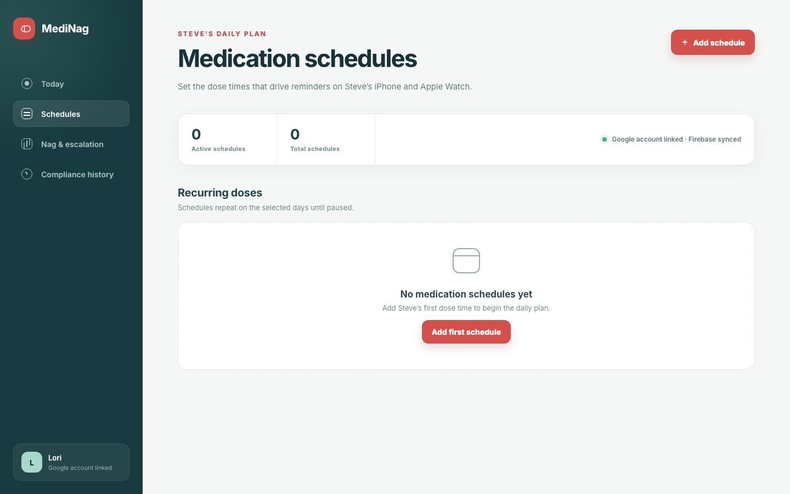

**Verifications:**

- [x] The dashboard is connected to the isolated Firebase environment
- [x] No medication schedule has been preloaded

## Lori saves the medication schedule through the dashboard

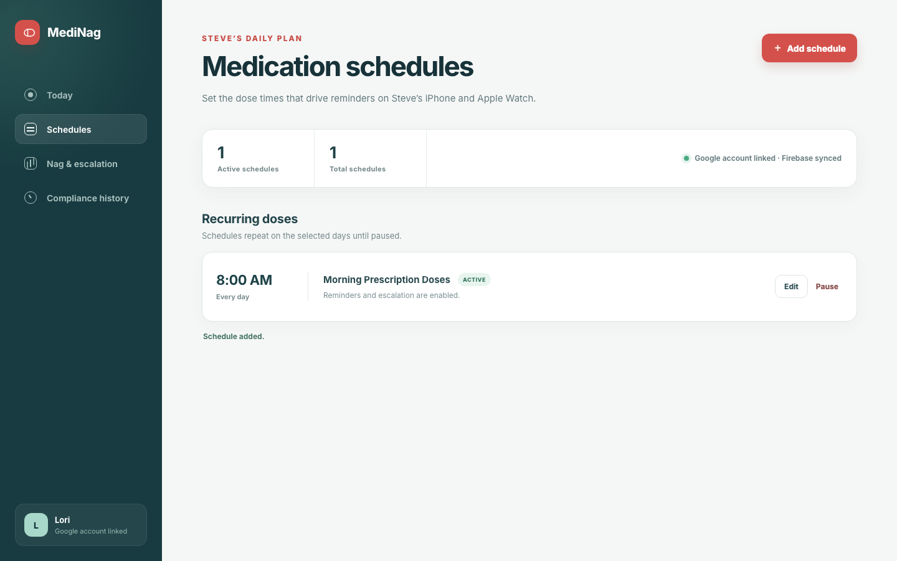

**Verifications:**

- [x] The saved medication label is rendered from the Firestore snapshot
- [x] The dashboard confirms the production repository write

## The schedule materializes the pending event Steve will receive

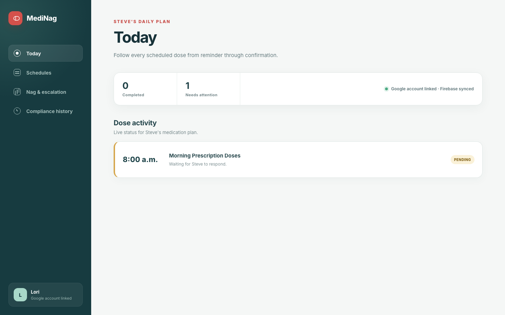

**Verifications:**

- [x] The pending event arrives through the dashboard Firestore listener
- [x] The event is waiting for Steve’s response

## Steve signs in to the same Firebase household

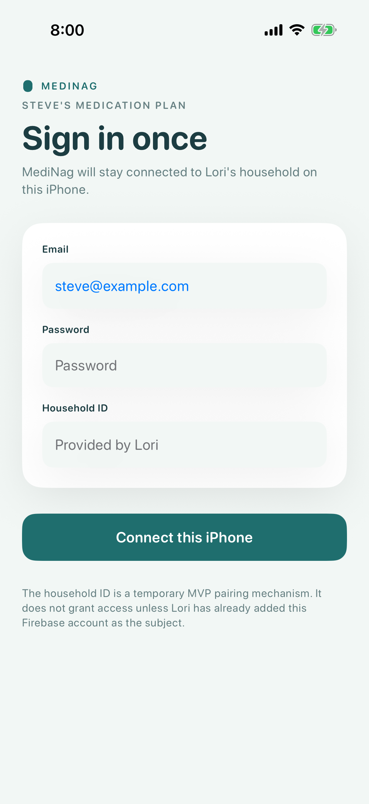

**Verifications:**

- [x] The real Firebase Auth form is visible
- [x] The password field is visible
- [x] The household pairing field is visible

## The iPhone receives Lori's schedule and event through Firestore

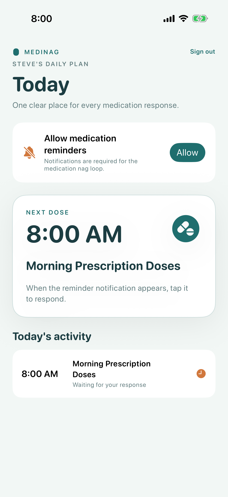

**Verifications:**

- [x] The medication label written by Lori appears from the snapshot listener
- [x] The real medication event is pending
- [x] The app offers notification permission

## iOS asks Steve to allow MediNag notifications

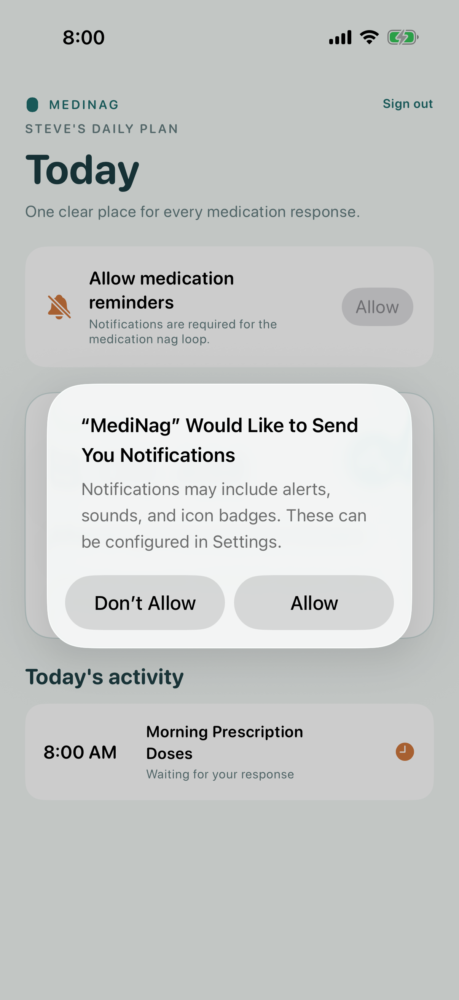

**Verifications:**

- [x] The permission prompt is rendered by iOS
- [x] The system offers an Allow action

## MediNag is ready and waits for the scheduled notification

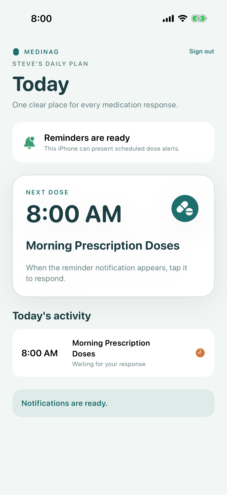

**Verifications:**

- [x] Notification permission is ready
- [x] The Firestore event remains visible while the app waits
- [x] No response is available before a notification
- [x] No completion is available before a notification

## With MediNag terminated, iOS retains the scheduled notification

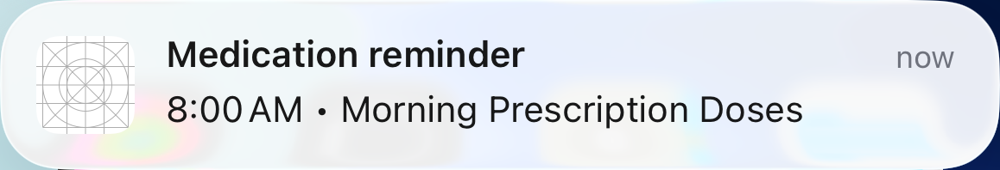

**Verifications:**

- [x] The first reminder is rendered by SpringBoard

## Tapping the notification cold-launches the response screen

**Verifications:**

- [x] The response screen is visible
- [x] The reminder sequence is correct
- [x] The reminder uses the logical scheduled time
- [x] Yes, I will is available
- [x] Yes, I did is available
- [x] Neither response has greater visual weight

## Yes, I will writes the snoozed response back to Firestore

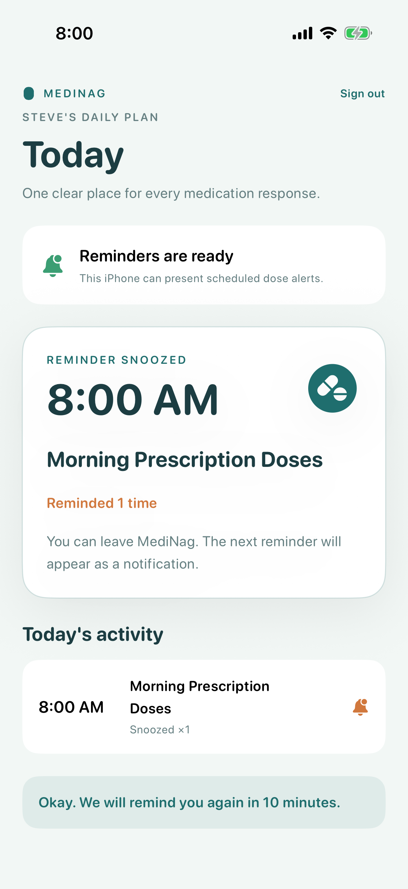

**Verifications:**

- [x] The snooze count increments
- [x] The configured repeat interval is confirmed
- [x] The Firestore listener receives the snoozed state
- [x] The response screen is dismissed

## With MediNag terminated, iOS retains the repeat notification

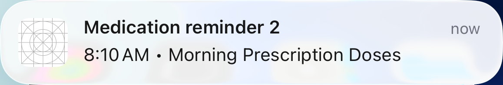

**Verifications:**

- [x] The repeat is rendered by SpringBoard

## Tapping reminder 2 cold-launches the app after logical time advances

**Verifications:**

- [x] The response screen is visible
- [x] The reminder sequence is correct
- [x] The reminder uses the logical scheduled time
- [x] Yes, I will is available
- [x] Yes, I did is available
- [x] Neither response has greater visual weight

## Yes, I did completes the real event and cancels further reminders

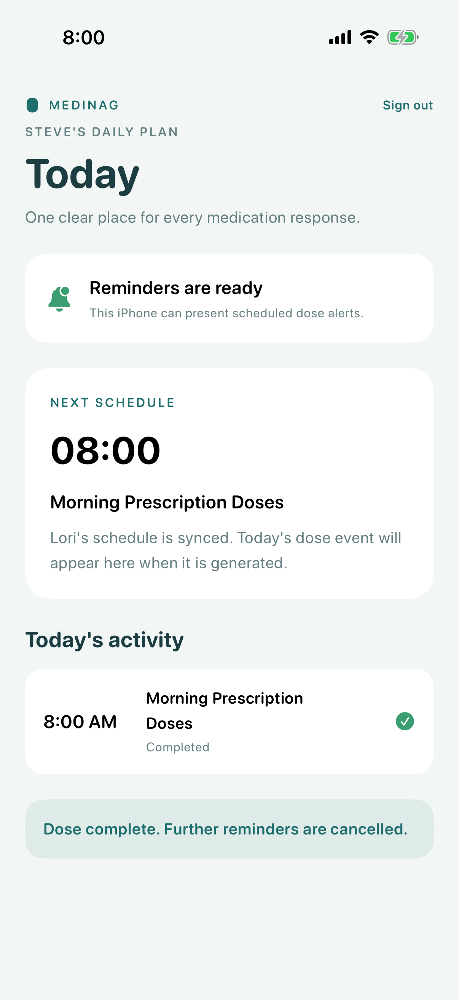

**Verifications:**

- [x] The Firestore listener receives completion
- [x] The app confirms notification cancellation
