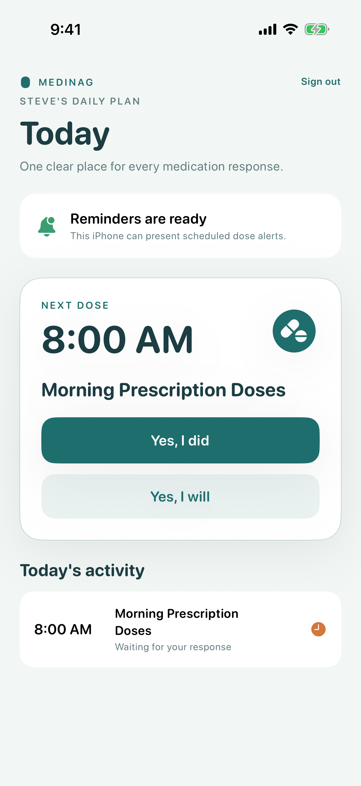
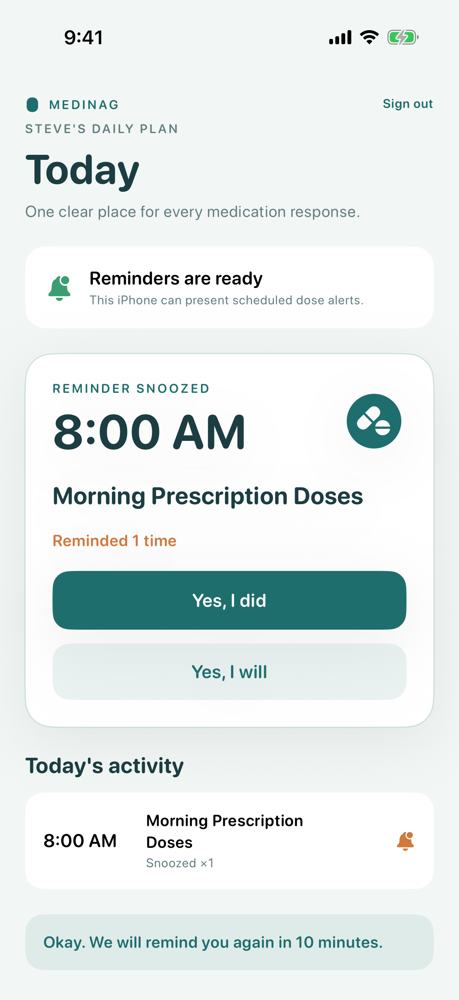
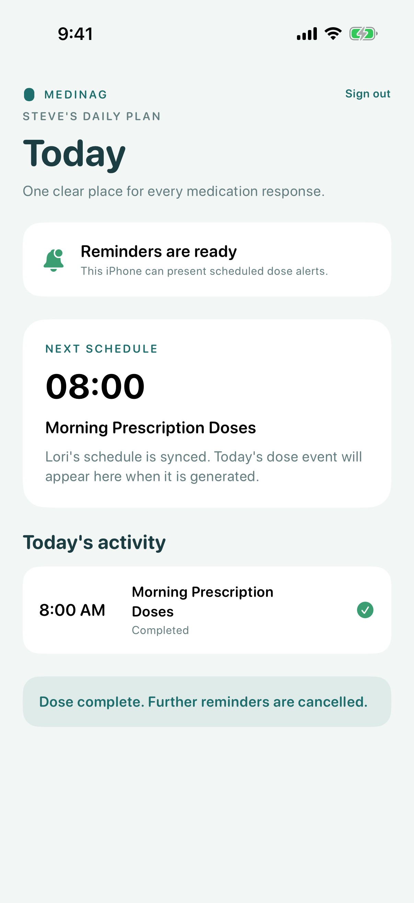

# Test: Steve responds to a scheduled dose

> As Steve, I want to snooze and then complete a medication reminder so Lori can see an accurate response.

## Surface coverage

- **Web Admin Dashboard:** not-applicable — This story exercises Steve's local iOS response loop.
- **iOS:** covered
- **watchOS:** not-applicable — watchOS is deferred until after the iOS MVP.

## Deterministic preconditions

- Fixture: `scheduled-dose-pending`
- Clock: 2026-08-03 08:00 America/Toronto
- Device: iPhone 17 on iOS 26.2, portrait, light appearance, standard Dynamic Type
- Status bar: 9:41, full Wi-Fi and cellular signal, charged battery at 100%

## Steve sees the pending morning dose and both clear response choices

**Verifications:**

- [x] The iOS Today screen is ready
- [x] The medication label is visible
- [x] The snooze response is available
- [x] The completion response is available

## Steve chooses Yes, I will and sees one scheduled repeat

**Verifications:**

- [x] The snooze count increments
- [x] The repeat interval is confirmed

## Steve chooses Yes, I did and further nags are cancelled

**Verifications:**

- [x] The dose is completed
- [x] The app confirms cancellation
