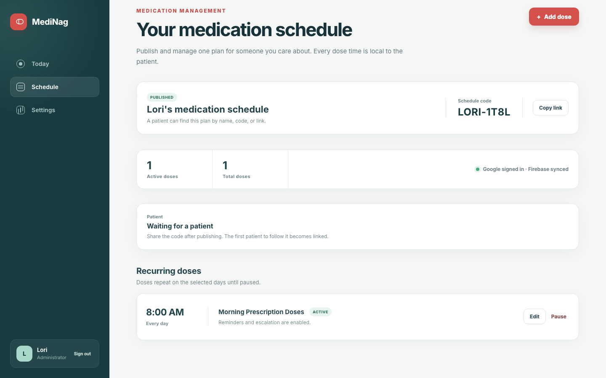
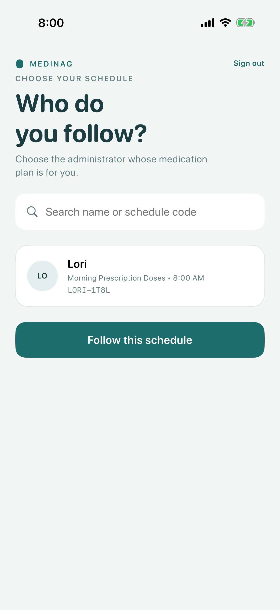
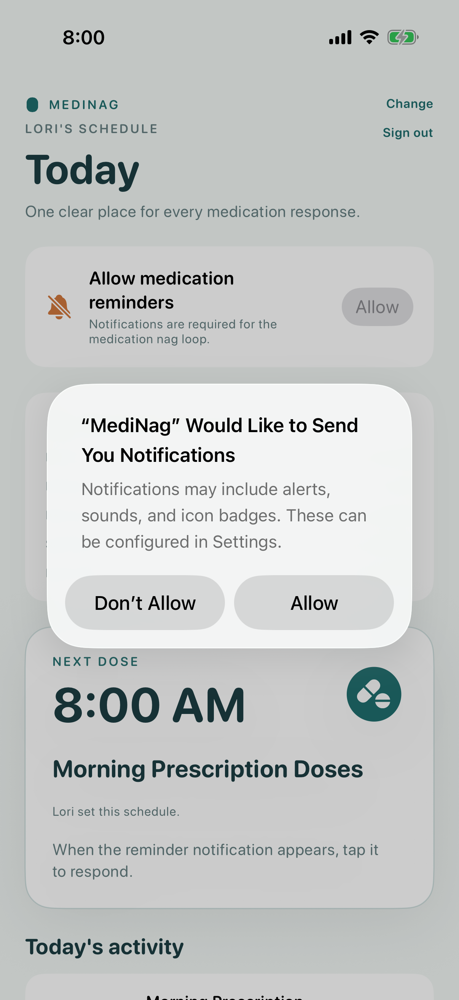
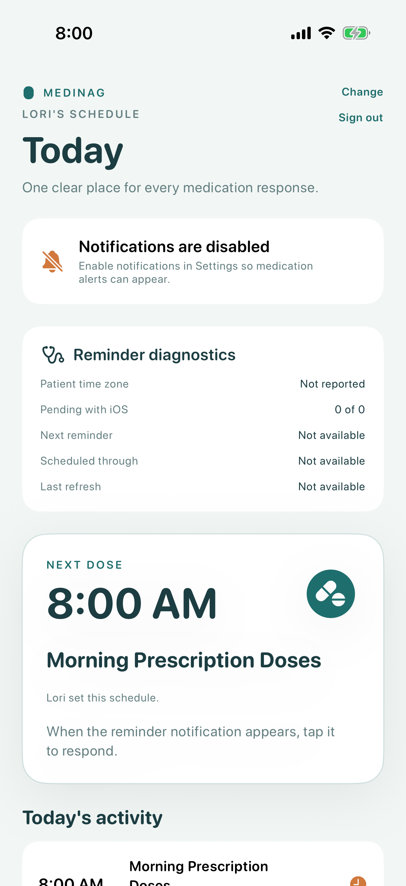
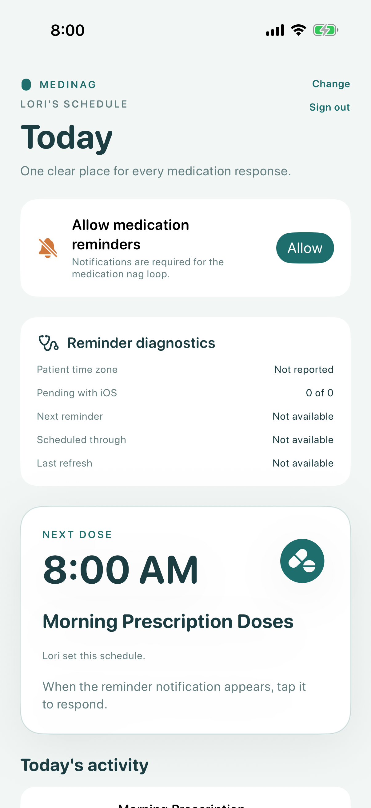
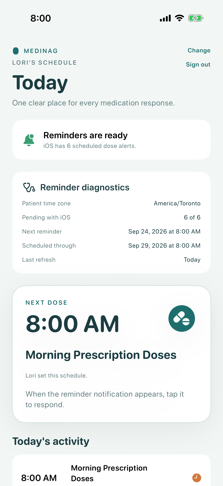
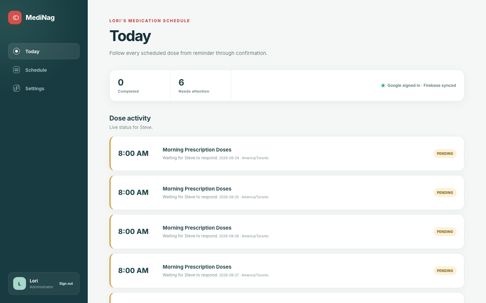

# Test: A notification failure alerts the administrator

> As Lori and Steve, we want a disabled notification permission to be visible to both of us and to alert Lori exactly once.

## Surface coverage

- **Web Admin Dashboard:** covered
- **iOS:** covered
- **watchOS:** not-applicable — watchOS is deferred until after the iOS MVP.

## Evidence environments

- **connected-emulators:** Fresh Firebase Authentication, Firestore, and Functions emulators running production rules and function code.
- **ios-simulator:** Pinned iPhone 17 / iOS 26.5 Simulator using the production notification authorization path.
- **captured-sms:** A local Twilio-compatible HTTP endpoint validates and records the production Function request; it does not claim carrier delivery.

## Deterministic preconditions

- Backend: fresh Firebase Authentication, Firestore, and Functions emulators with production rules and function code
- Data: Lori creates and publishes the schedule and SMS destination through visible dashboard controls
- Identity: run-specific Google-provider identities use the Firebase Auth Emulator
- Device: fresh iPhone 17 on iOS 26.5 with notification authorization not yet determined
- SMS: the production alert Function calls a captured Twilio-compatible HTTP endpoint

## Lori publishes a schedule with an SMS alert destination

**Verifications:**

- [x] The schedule is published through the dashboard
- [x] The administrator SMS destination is saved through the dashboard

## Steve starts the patient sign-in flow

**Verifications:**

- [x] Google is the visible patient sign-in action

## MediNag signs into the isolated Firebase Auth Emulator identity

**Verifications:**

- [x] The authentication progress state is visible
- [x] Steve explicitly continues to schedule selection

## Steve chooses Lori's published schedule

**Verifications:**

- [x] Lori's published plan is visible from Firebase
- [x] The published plan identifies the medication

## The iPhone follows Lori's schedule before requesting permission

**Verifications:**

- [x] The medication event arrives through the Firestore listener
- [x] The app offers the notification permission action

## iOS asks whether MediNag may send notifications

**Verifications:**

- [x] The notification permission sheet is rendered by iOS
- [x] The system offers a Don't Allow action

## Steve sees that medication notifications are disabled

**Verifications:**

- [x] The patient sees that notifications are disabled
- [x] The patient is told to enable notifications in Settings
- [x] The client-visible failure is written through Firestore

## Lori sees the incident and its captured SMS result

**Verifications:**

- [x] The dashboard shows the same notification authorization incident
- [x] The provider acceptance, message ID, and single attempt are recorded
- [x] Exactly one authenticated Twilio-compatible request is captured

## Steve reinstalls MediNag after restoring notification permission

**Verifications:**

- [x] The fresh installation offers the patient Google sign-in action

## Steve reconnects to his existing followed schedule

**Verifications:**

- [x] The Auth Emulator identity reconnects without recreating the relationship

## The reinstalled app receives the existing medication event

**Verifications:**

- [x] The existing followed plan and medication event arrive from Firestore
- [x] Notification permission can be requested again on the fresh installation

## iOS offers notification permission again

**Verifications:**

- [x] The fresh system permission sheet is rendered by iOS
- [x] The system offers an Allow action

## Steve sees restored reminder coverage

**Verifications:**

- [x] The patient sees that reminders are ready
- [x] iOS confirms the expected pending reminder requests

## Lori sees observed recovery without a duplicate SMS

**Verifications:**

- [x] The dashboard marks the authorization incident resolved after matching coverage
- [x] The administrator sees ready iPhone reminder coverage
- [x] Recovery sends no duplicate SMS request
